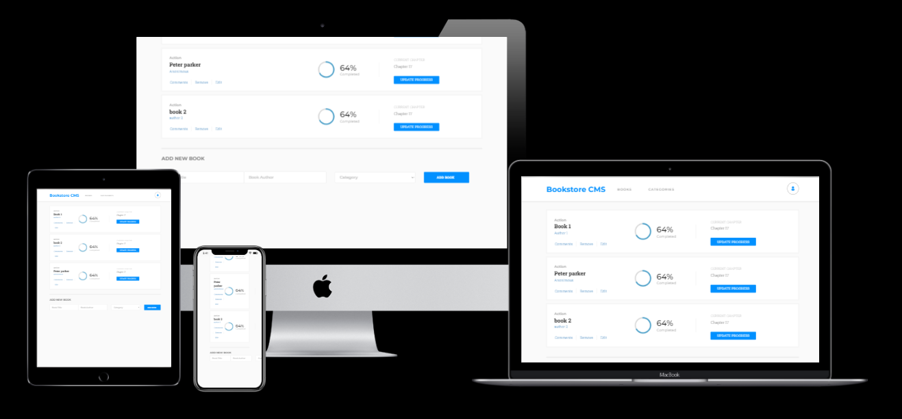

# Bookstore 

>  This project consists of a CRUD website, where the user can manage a list of books. Build using React and Redux consuming the bookstore API service provided by the Microverse team. This project is meant to practice Redux knowledge like; Store, actions, reducers, and the principle of immutability. Also, learned and practice using React-Redux together with APIs.


## App screenshot 



## Built With 

- React 
- Redux
      

## Live Demo 


[Netlify](https://dev--relaxed-liger-ac7a98.netlify.app)  


## Usage  

Be sure to have [Node.js](https://nodejs.org/) installed before proceeding.

```shell
# Clone the repo
git clone https://github.com/wandergithub/Bookstore
# Change directory
cd Bookstore
# Install dependencies
npm i
# Start local server
npm start
```

## Authors  

👤 **Author**


- GitHub: [@wandergithub](https://github.com/wandergithub)
- Twitter: [@wanderklk1](https://twitter.com/wanderklk1)
- LinkedIn: [Wander A. Gonzalez](https://www.linkedin.com/in/wander-a-gonzalez-53127b205/)

## Contributing  

Contributions, issues, and feature requests are welcome!

Feel free to check the [issues page](../../issues/).

## Show your support  

Give a ⭐️ if you like this project!

## Acknowledgments

This project was bootstrapped with [Create React App](https://github.com/facebook/create-react-app).

## License 

This project is [MIT](./MIT.md) licensed.
<br>
<br>
<br>


